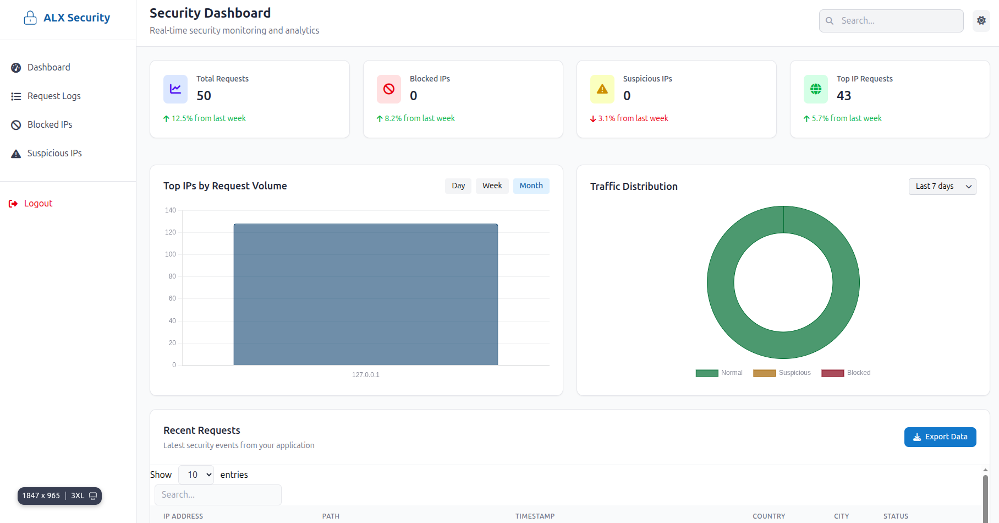
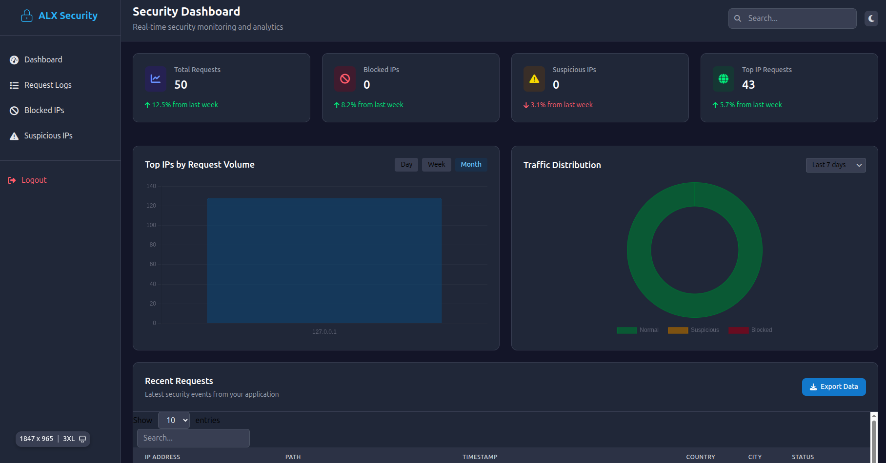

# 📌 IP Tracking: Security and Analytics

[](https://www.python.org/)
[](https://www.djangoproject.com/)
[](LICENSE)
[](#)
[](#)

---

## 🎯 Project Overview

This project demonstrates how to implement **IP tracking in Django** to improve security, monitor user activity, and enable analytics while respecting privacy and compliance requirements.

It includes:

* IP **logging** with middleware
* IP **blacklisting** with management commands
* IP **geolocation** enrichment
* **Rate limiting** to prevent abuse
* **Anomaly detection** with Celery tasks
* **Dark mode dashboard** with Tailwind CSS and Heroicons

---

## 🖼️ Screenshots

### Light Mode


### Dark Mode


---

## 📚 Learning Objectives

By completing this project, you will be able to:

* Log IP addresses, request paths, and timestamps via Django middleware.
* Block malicious IPs using blacklists.
* Integrate geolocation APIs to add contextual data (country, city).
* Enforce request rate limits for security and fairness.
* Detect abnormal traffic patterns using log analysis and basic ML.
* Implement a **responsive, dark-mode-friendly dashboard** using Tailwind CSS.
* Apply GDPR/CCPA best practices for compliance.

---

## ⚙️ Project Setup

### 1. Clone Repository

```bash
git clone https://github.com/<your-username>/alx-backend-security.git
cd alx-backend-security
````

### 2. Create Virtual Environment

```bash
python3 -m venv venv
source venv/bin/activate   # Linux/macOS
venv\Scripts\activate      # Windows
```

### 3. Install Dependencies

```bash
pip install -r requirements.txt
```

### 4. Run Migrations

```bash
python manage.py makemigrations
python manage.py migrate
```

### 5. Start Development Server

```bash
python manage.py runserver
```

---

## 🛠️ Features

### 🔹 Task 0: Basic IP Logging Middleware

* Logs client IP, timestamp, and request path into `RequestLog` model.

### 🔹 Task 1: IP Blacklisting

* Block specific IPs using the `BlockedIP` model.
* Add IPs with:

```bash
python manage.py block_ip <ip_address>
```

### 🔹 Task 2: IP Geolocation Analytics

* Middleware integrates with **django-ipgeolocation** to add country & city fields.
* Results cached for **24h** to reduce API calls.

### 🔹 Task 3: Rate Limiting

* Protects sensitive views using **django-ratelimit**.
* Limits:

  * **Anonymous users** → 5 requests/minute
  * **Authenticated users** → 10 requests/minute

### 🔹 Task 4: Anomaly Detection

* **Celery task** runs hourly:

  * Flags IPs with >100 requests/hour
  * Flags IPs accessing sensitive paths (`/admin`, `/login`)
* Stores flagged IPs in `SuspiciousIP` model.

### 🔹 Task 5: Dark Mode Dashboard

* Responsive dashboard built with **Tailwind CSS**.
* Supports **light and dark mode** based on user preference or system theme.
* Includes **charts, cards, and status badges** for IP analytics.

---

## 🔑 Tools & Libraries

* **Django** – web framework
* **django-ipware** – reliable IP extraction
* **django-ratelimit** – request throttling
* **django-ipgeolocation** – geolocation lookup
* **Redis** – caching & Celery broker
* **Celery** – scheduled background tasks
* **scikit-learn** – anomaly detection support
* **GeoIP2 / ipinfo.io** – geolocation data
* **Tailwind CSS** – modern styling with dark mode support
* **Heroicons** – dashboard icons

---

## 📊 Real-World Applications

* Blocking malicious scrapers and spam bots
* Logging access to sensitive endpoints (`/admin`, `/login`)
* Personalizing content based on region
* Enforcing fair API usage limits
* Detecting early signs of abuse

---

## ⚖️ Privacy & Legal Considerations

* **Anonymization**: IPs can be truncated before storage.
* **Transparency**: Disclose tracking in Privacy Policy.
* **Retention**: Logs auto-deleted after a safe period.
* **Fairness**: Avoid blanket regional bans.

---

## 🚀 How to Run Celery Worker

Make sure Redis is running, then:

```bash
celery -A alx_backend_security worker -l info
celery -A alx_backend_security beat -l info
```

---

## 🧪 Testing

Run tests:

```bash
python manage.py test ip_tracking
```


